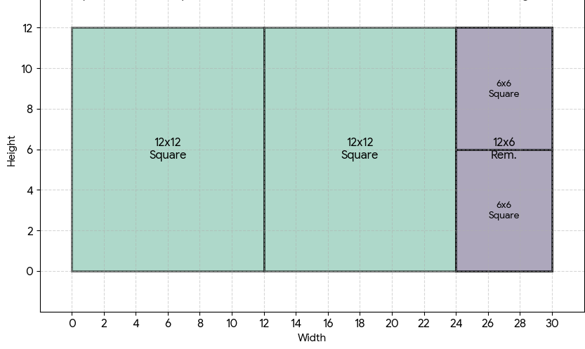

# Relogify Maintainer Documentation

Welcome to the **Relogify** website maintainer documentation! This guide is written specifically for novices and maintainers who want to manage, update, and expand the website using simple, hardcoded HTML, CSS, and JavaScript.

The framework is set up as minimal and basic as possible—no Node.js build tools, webpack, or command-line compilation is required. Any file you edit and save can be previewed immediately by opening the HTML file in any web browser.

---

## Table of Contents
1. [Site Structure Overview](#1-site-structure-overview)
2. [Creating & Formatting Articles](#2-creating--formatting-articles)
3. [Spacing Images & Big Diagrams](#3-spacing-images--big-diagrams)
4. [Writing Readable Math Equations](#4-writing-readable-math-equations)
5. [Using the WIP Symbol for Unfinished Articles](#5-using-the-wip-symbol-for-unfinished-articles)
6. [Managing the Weekly RelogiFact & History Popup](#6-managing-the-weekly-relogifact--history-popup)
7. [Workflow & Deploying Changes](#7-workflow--deploying-changes)

---

## 1. Site Structure Overview

- `index.html` — The main homepage featuring the Relogifact of the Day, Guide, and Contact information.
- `math.html` — Section index listing all Math articles.
- `physics.html` — Section index listing all Physics articles.
- `additional.html` — Section index listing all Additional articles.
- `donations.html` — Donations page.
- `euclidean-algorithm.html` — Sample published math article demonstrating images, equations, and proof diagrams.
- `Article Template` — Template HTML file to copy when creating any new article page.
- `styles.css` — Global CSS stylesheet containing styling for layouts, images, math equations, WIP badges, and modal popups.
- `script.js` — Client-side JavaScript handling the mobile sidebar toggle, copyright year, and the **RelogiFact History** popup modal.
- `images/` — Directory containing all site logos, favicons, and article diagrams.

---

## 2. Creating & Formatting Articles

To create a new article page (e.g., `eulers-formula.html`):

1. Duplicate the `Article Template` file and rename it (e.g., `eulers-formula.html`).
2. Open the file in your text editor and update the `<title>` tag and `<h1 class="page-title">`.
3. In the sidebar navigation `<ul class="nav-links">`, make sure the correct section link has class `active` (e.g., `Math`).
4. Write your content inside `<div class="article-layout">` blocks as shown below.
5. Add a link to your new article on the appropriate section page (`math.html`, `physics.html`, or `additional.html`).

---

## 3. Spacing Images & Big Diagrams

Relogify uses a **Spaced Image Layout System** where images automatically sit to the right of their associated text paragraph (with a guaranteed 7px gap on desktop, stacking cleanly on mobile devices).

### Spacing Images Next to Associated Text
Instead of grouping all images at the bottom of the page, split your article into logical sections using `<div class="article-layout">` blocks:

```html
<!-- Section 1: Explanation -->
<div class="article-layout">
  <div class="article-text">
    <p>
      Imagine you're trying to find the Greatest Common Divisor between two numbers...
    </p>
  </div>
  <div class="article-images">
    <div class="article-img-box">
      
    </div>
  </div>
</div>

<!-- Section 2: Next Example -->
<div class="article-layout">
  <div class="article-text">
    <p>
      Let's look at an example...
    </p>
  </div>
  <div class="article-images">
    <div class="article-img-box">
      
    </div>
  </div>
</div>
```

### Making an Image Big (e.g., Proof Diagrams)
When you have a detailed visual diagram or geometric proof that needs more width than a side image, use the `big` modifier class on the image box:

```html
<div class="article-img-box big">
  
</div>
```
- Standard image box (`.article-img-box`): 280px × 210px (sits to the right of text).
- Big image box (`.article-img-box.big`): Expands up to 720px wide with responsive height.

---

## 4. Writing Readable Math Equations

Mathematical equations on Relogify are styled using a clean, readable monospace font (`Roboto Mono`) so symbols, operators, and fractions are easy to read.

### Standalone Equation Blocks
For equations that should appear on their own line with a highlight box and left border:

```html
<div class="math-equation">1729 = 1³ + 12³ = 9³ + 10³</div>
```

Multiple lines can be grouped inside a single block:
```html
<div class="math-equation">
  a/d = (b/d * q) + (a - b*q)/d <br>
  a/d = (b/d * q) + a/d - b*q/d <br>
  0 = 0
</div>
```

### Inline Math Variables & Notation
For symbols or short expressions inside a sentence:
```html
<p>
  Let the variables be <span class="math-inline">{a, b}</span> denoted as <span class="math-inline">gcd(a, b)</span>.
</p>
```

---

## 5. Using the WIP Symbol for Unfinished Articles

When an article is listed on a section page (`math.html`, `physics.html`, or `additional.html`) but is still being written, mark it with a Work In Progress (WIP) symbol so readers know it is under construction.

### How to Add the WIP Badge
Add `<span class="wip-badge">🚧 WIP</span>` after the article name:
```html
<li><a href="eulers-formula.html">&#8250; Euler's Formula <span class="wip-badge">🚧 WIP</span></a></li>
```

Alternatively, simply add `class="wip"` to the `<a>` link tag—CSS will automatically display the badge:
```html
<li><a href="eulers-formula.html" class="wip">&#8250; Euler's Formula</a></li>
```

### Removing the WIP Badge
Once an article is complete and ready to publish, delete `<span class="wip-badge">🚧 WIP</span>` (or remove `class="wip"`).

---

## 6. Managing the Weekly RelogiFact & History Popup

The homepage features a **Relogifact Of The Day** along with a **View History** button that opens a popup modal archive showing past weekly RelogiFacts.

### Updating the Current Homepage Fact
In `index.html`, locate the `<!-- RelogiFact -->` block and update the text:
```html
<p class="section-text-2"></p>
<p class="section-text-3">1729</p> 
<p class="section-text-2"> 
  is the smallest number which can be expressed as the sum of two cubes...
</p>
```

### Adding an Entry to the History Popup
All history cards are stored in a simple text file named `weeklyfact.txt` located in the root directory.

1. Open `weeklyfact.txt` in any text editor.
2. Add a new line at the **top** of the file formatted with the fact inside quotation marks and the date:
```text
"example" July 30, 2026
```
3. Save the file. When a user clicks **View History** on `index.html`, the popup will automatically fetch `weeklyfact.txt` and display your facts!

---

## 7. Workflow & Deploying Changes

Because Relogify uses no build steps, deploying changes is as simple as committing and pushing your files using Git:

1. **Test Locally:** Open any modified `.html` file directly in your web browser to verify layouts, images, and popups.
2. **Check Status:**
   ```bash
   git status
   ```
3. **Commit Changes:**
   ```bash
   git add .
   git commit -m "Description of your change"
   ```
4. **Push to Development Branch:**
   ```bash
   git push origin dev
   ```

When changes on the `dev` branch are reviewed and ready to go live, merge `dev` into the `main` branch.
