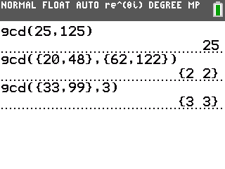
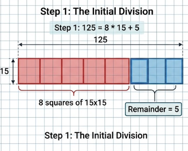
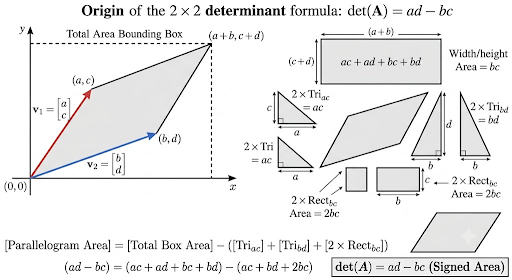

# Relogify Maintainer Documentation

Welcome to the **Relogify** website maintainer documentation! This guide is written specifically for novices and maintainers who want to manage, update, and expand the website using simple, hardcoded HTML, CSS, and JavaScript.

The framework is set up as minimal and basic as possible—no Node.js build tools, webpack, or command-line compilation is required. Any file you edit and save can be previewed immediately by opening the HTML file in any web browser.

---

## Table of Contents
1. [Site Structure Overview](#1-site-structure-overview)
2. [Creating & Formatting Articles](#2-creating--formatting-articles)
3. [Spacing Images & Big Diagrams](#3-spacing-images--big-diagrams)
4. [Writing Readable Math Equations](#4-writing-readable-math-equations)
5. [Using the WIP Symbol for Unfinished Articles](#5-using-the-wip-symbol-for-unfinished-articles)
6. [Managing Weekly Facts & Archive Popups](#6-managing-weekly-facts--archive-popups)
7. [Homepage Widgets, Suggestion Email & Creator Profiles](#7-homepage-widgets-suggestion-email--creator-profiles)
8. [Workflow & Deploying Changes](#8-workflow--deploying-changes)
9. [Licensing](#9-licensing)

---

## 1. Site Structure Overview

- `index.html` — The main homepage featuring the Weekly RelogiFact, Guide, and Contact information.
- `math.html` — Section index listing all Math articles.
- `physics.html` — Section index listing all Physics articles.
- `additional.html` — Section index listing all Additional articles.
- `donations.html` — Donations page.
- `euclidean-algorithm.html` — Sample published math article demonstrating images, equations, and proof diagrams.
- `Article Template` — Template HTML file to copy when creating any new article page.
- `styles.css` — Global CSS stylesheet containing styling for layouts, images, math equations, WIP badges, and modal popups.
- `script.js` — Client-side JavaScript handling the mobile sidebar toggle, copyright year, and the **RelogiFact History** popup modal.
- `images/` — Directory containing all site logos, favicons, and article diagrams.

---

## 2. Creating & Formatting Articles

To create a new article page (e.g., `eulers-formula.html`):

1. Duplicate the `Article Template` file and rename it (e.g., `eulers-formula.html`).
2. Open the file in your text editor and update the `<title>` tag and `<h1 class="page-title">`.
3. In the sidebar navigation `<ul class="nav-links">`, make sure the correct section link has class `active` (e.g., `Math`).
4. Write your content inside `<div class="article-layout">` blocks as shown below.
5. Add a link to your new article on the appropriate section page (`math.html`, `physics.html`, or `additional.html`).

### Alternating Paragraph Indentation (`.indent`)
To make longer paragraphs look less condensed, add `class="indent"` to every other paragraph or indented block:
```html
<p>First paragraph in the section...</p>
<p class="indent">Second paragraph with extra left indent...</p>
<p>Third paragraph in the section...</p>
```

---

## 3. Spacing Images & Big Diagrams

Relogify uses a **Spaced Image Layout System** where images automatically sit to the right of their associated text paragraph (with a guaranteed 7px gap on desktop, stacking cleanly on mobile devices).

### Spacing Images Next to Associated Text
Instead of grouping all images at the bottom of the page, split your article into logical sections using `<div class="article-layout">` blocks:

```html
<!-- Section 1: Explanation -->
<div class="article-layout">
  <div class="article-text">
    <p>
      Imagine you're trying to find the Greatest Common Divisor between two numbers...
    </p>
  </div>
  <div class="article-images">
    <div class="article-img-box">
      
    </div>
  </div>
</div>

<!-- Section 2: Next Example -->
<div class="article-layout">
  <div class="article-text">
    <p>
      Let's look at an example...
    </p>
  </div>
  <div class="article-images">
    <div class="article-img-box">
      
    </div>
  </div>
</div>
```

### Sizing Images (Standard, Medium, and Big)
Relogify provides three image box sizing options:
- **Standard Image Box (`.article-img-box`)**: 280px wide (default size for small side diagrams).
- **Medium Image Box (`.article-images.medium > .article-img-box.medium`)**: 380px wide (ideal for labeled diagrams like Linearity and the Standard Unit Square).
- **Big Image Box (`.article-img-box.big`)**: Expands up to 720px wide across the full column width (ideal for comprehensive proofs and concept diagrams).

```html
<!-- Medium Image Box Example -->
<div class="article-layout">
  <div class="article-text">
    <p>Explanation text...</p>
  </div>
  <div class="article-images medium">
    <div class="article-img-box medium">
      
    </div>
  </div>
</div>
```

---

## 4. Writing Readable Math Equations

Mathematical equations on Relogify are styled using a clean, readable monospace font (`Roboto Mono`) so symbols, operators, and fractions are easy to read.

### Standalone Equation Blocks
For equations that should appear on their own line with a highlight box and left border:

```html
<div class="math-equation">1729 = 1³ + 12³ = 9³ + 10³</div>
```

Multiple lines can be grouped inside a single block:
```html
<div class="math-equation">
  a/d = (b/d * q) + (a - b*q)/d <br>
  a/d = (b/d * q) + a/d - b*q/d <br>
  0 = 0
</div>
```

### Inline Math Variables & Notation
For symbols or short expressions inside a sentence:
```html
<p>
  Let the variables be <span class="math-inline">{a, b}</span> denoted as <span class="math-inline">gcd(a, b)</span>.
</p>
```

---

## 5. Using the WIP Symbol for Unfinished Articles

When an article is listed on a section page (`math.html`, `physics.html`, or `additional.html`) but is still being written, mark it with a Work In Progress (WIP) symbol so readers know it is under construction.

### How to Add the WIP Badge
Add `<span class="wip-badge">🚧 WIP</span>` after the article name:
```html
<li><a href="eulers-formula.html">&#8250; Euler's Formula <span class="wip-badge">🚧 WIP</span></a></li>
```

Alternatively, simply add `class="wip"` to the `<a>` link tag—CSS will automatically display the badge:
```html
<li><a href="eulers-formula.html" class="wip">&#8250; Euler's Formula</a></li>
```

### Removing the WIP Badge
Once an article is complete and ready to publish, delete `<span class="wip-badge">🚧 WIP</span>` (or remove `class="wip"`).

---

## 6. Managing Weekly Facts & Archive Popups

Relogify automatically pops up a modal on the homepage with the **latest weekly fact** and provides a **View History** modal archive where all past facts can be sorted by date.

### How Weekly Facts Work
- The homepage **Weekly RelogiFact** section automatically displays the **latest weekly fact** from `weekly-facts/`, ensuring the fact on the page always matches the latest fact and appears in the **View History** archive.
- All weekly facts are stored as individual `.txt` files in the **`weekly-facts/`** directory.
- Each file is named with the US date format: **`MM-DD-YY.txt`** (for example, `7-30-26.txt` for July 30, 2026).
- Inside the `.txt` file, place the fact text in quotation marks along with the date:
  ```text
  "<span class='section-text-3'>1729</span> is the smallest number which can be expressed as the sum of two cubes in two different ways: <div class='math-equation'>1729 = 1³ + 12³ = 9³ + 10³</div> This number is known as the Hardy-Ramanujan number, or Ramanujan's Constant, named after the mathematicians G.H. Hardy and Srinivasa Ramanujan." July 30, 2026
  ```
- To determine the **latest weekly fact**, the system checks the US date in the filename. For example, `7-30-26.txt` is displayed as the latest fact if there is no `7-31-26.txt` or beyond.
- **Future-Date Release Scheduling:** You can schedule weekly facts for future weeks in advance! Simply name the file with the future release date (for example, `8-2-26.txt` for August 2, 2026). The site checks the filename date against the current local date—future scheduled facts remain hidden until their release date arrives.
- **Don't Show Again:** In the automatic popup, users can check *"Don't show this weekly fact again"*. The system stores the latest filename in `localStorage` so it won't pop up again until a newer weekly fact file is published.

### How to Add or Schedule a Weekly Fact
1. Create a new text file inside `weekly-facts/` using US date format (e.g. `8-2-26.txt`).
2. Inside `weekly-facts/8-2-26.txt`, write:
   ```text
   "Your new fact text goes here" August 2, 2026
   ```
3. Open `weekly-facts/index.txt` and add your filename `8-2-26.txt` to the list.
4. Save your files. When that release date arrives, `8-2-26.txt` will automatically release and become the newest fact! Older files remain in the **View History** archive and can be sorted chronologically.

---

## 7. Homepage Widgets, Suggestion Email & Creator Profiles

### Concept Explorer Widget
The homepage features an interactive **Spark an Intuition &#9889;** widget that allows readers to cycle through curated conceptual summaries directly from published Relogify articles (such as `euclidean-algorithm.html` and `linear-algebra.html`), complete with a **Read Article &rarr;** link. Maintainers can add new excerpts to the `CONCEPTS` list in `script.js` as new articles are published.

### Embedded Article Suggestion Email Card
Readers can submit ideas via the embedded **Suggest an Article** card on `index.html`. Clicking **Email Suggestion** opens a pre-formatted email to `suggestions@example.com`.

### Customizing Creator Profile Cards (Resumes & Portfolios)
The **Creators & Contact** section on `index.html` features dedicated profile cards for Prajwal Sharma-Gaire and John Cummiskey.
- **Photo Avatar:** To replace the placeholder logo with your photo, save your image to `images/` (e.g., `images/prajwal.jpg`) and change the `src` attribute in `.creator-avatar`.
- **Bios & Role:** Update your paragraph inside `.creator-bio` to highlight your research, background, and academic focus.
- **Resume & Portfolio Links:** Customize the `href` attributes on `.creator-btn` to point directly to your personal portfolio, LinkedIn, GitHub, or resume PDF.

---

## 8. Workflow & Deploying Changes

Because Relogify uses no build steps, deploying changes is as simple as committing and pushing your files using Git:

1. **Test Locally:** Open any modified `.html` file directly in your web browser to verify layouts, images, and popups.
2. **Check Status:**
   ```bash
   git status
   ```
3. **Commit Changes:**
   ```bash
   git add .
   git commit -m "Description of your change"
   ```
4. **Push to Development Branch:**
   ```bash
   git push origin dev
   ```

When changes on the `dev` branch are reviewed and ready to go live, merge `dev` into the `main` branch.

---

## 9. Licensing

Relogify is open-source software licensed under the **GNU Affero General Public License Version 3.0 (AGPL-3.0)**. See the `LICENSE` file in the root directory for full terms.
